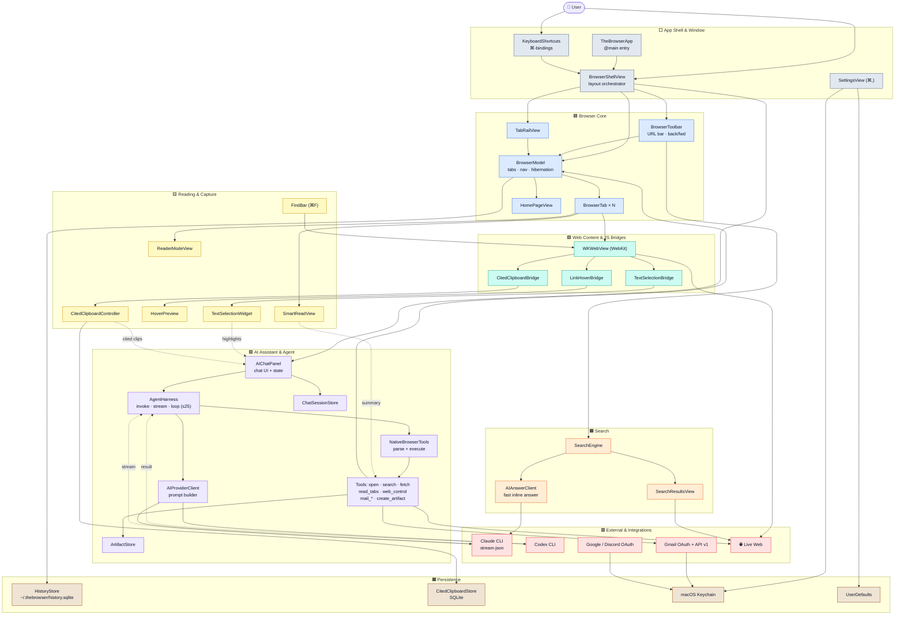
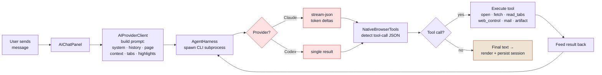
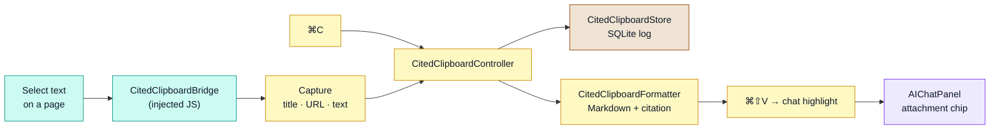

# TheBrowser — Systems & Interaction Map

A color-coded map of the subsystems inside TheBrowser and how they talk to each
other. TheBrowser is a **single-process native macOS app** (Swift 6 · SwiftUI ·
WebKit, built with SwiftPM). The only child process is the AI provider CLI
(Claude or Codex); everything else runs on the main actor with reactive SwiftUI
state.

> The diagrams below are [Mermaid](https://mermaid.js.org/) — they render
> automatically on GitHub and in most Markdown viewers. Each subsystem is tinted
> by **layer**; the key is the color chart in the next section.

---

## Color chart (the key)

| Swatch | Layer | What lives here | Hex (fill / stroke) |
|:------:|-------|-----------------|---------------------|
| ⬜ | **App Shell & Window** | `@main` entry, layout orchestrator, keyboard, settings | `#E2E8F0` / `#475569` |
| 🟦 | **Browser Core** | tab model, navigation, toolbar, tab rail, home page | `#DBEAFE` / `#2563EB` |
| 🟩 | **Web Content & JS Bridges** | `WKWebView` + scripts injected into every page | `#CCFBF1` / `#0D9488` |
| 🟨 | **Reading & Capture** | reader mode, smart read, hover preview, find, cited clipboard | `#FEF9C3` / `#CA8A04` |
| 🟪 | **AI Assistant & Agent** | chat UI, agent harness, provider client, tools, sessions | `#EDE9FE` / `#7C3AED` |
| 🟧 | **Search** | engines, results rendering, fast inline AI answer | `#FFEDD5` / `#EA580C` |
| 🟫 | **Persistence** | SQLite stores, chat sessions, Keychain, UserDefaults | `#EFE4D3` / `#92400E` |
| 🟥 | **External & Integrations** | provider CLIs, Gmail/Google/Discord, the live web | `#FEE2E2` / `#DC2626` |

---

## 1 · System map

How the major pieces are wired. Solid arrows = ownership / direct calls;
dotted arrows = asynchronous data flow (streamed events, captured context).

---

## 2 · The AI agent loop

What happens between hitting **Send** and seeing an answer. The harness keeps
feeding tool results back to the provider until the model stops calling tools or
the iteration cap (`maxAgentIterations = 25`) is reached.

---

## 3 · Cited-clipboard capture

Every copy off a web page is tagged with its source so it can be pasted back
into chat (or anywhere) as a properly attributed Markdown citation.

---

## Subsystem reference

| 🎨 | Subsystem | Key files | Responsibility |
|:--:|-----------|-----------|----------------|
| ⬜ | App Shell | [TheBrowserApp.swift](Sources/TheBrowser/App/TheBrowserApp.swift), [BrowserShellView.swift](Sources/TheBrowser/Browser/BrowserShellView.swift), [KeyboardShortcuts.swift](Sources/TheBrowser/App/KeyboardShortcuts.swift) | Entry point, master `rail │ center │ chat` layout, global ⌘-bindings |
| 🟦 | Browser Core | [BrowserModel.swift](Sources/TheBrowser/Browser/BrowserModel.swift), [BrowserModels.swift](Sources/TheBrowser/Browser/BrowserModels.swift), [BrowserToolbar.swift](Sources/TheBrowser/Browser/BrowserToolbar.swift), [TabRailView.swift](Sources/TheBrowser/Browser/TabRailView.swift) | Tab/navigation state, per-tab `WKWebView` lifecycle, idle-tab hibernation |
| 🟩 | Web & Bridges | [BrowserWebView.swift](Sources/TheBrowser/Browser/BrowserWebView.swift), [TextSelectionBridge.swift](Sources/TheBrowser/Browser/TextSelectionBridge.swift), [CitedClipboardBridge.swift](Sources/TheBrowser/Clipboard/CitedClipboardBridge.swift) | WebKit host + `postMessage` bridges for selection, copy, link-hover |
| 🟨 | Reading & Capture | [SmartReadView.swift](Sources/TheBrowser/Browser/SmartReadView.swift), [ReaderModeView.swift](Sources/TheBrowser/Browser/ReaderModeView.swift), [CitedClipboardController.swift](Sources/TheBrowser/Clipboard/CitedClipboardController.swift), [HoverPreview/](Sources/TheBrowser/Browser/HoverPreview), [FindBar/](Sources/TheBrowser/Browser/FindBar) | AI summaries, distraction-free reading, citations, link previews, ⌘F |
| 🟪 | AI Assistant | [AIChatPanel.swift](Sources/TheBrowser/Chat/AIChatPanel.swift), [AgentHarness.swift](Sources/TheBrowser/Chat/AgentHarness.swift), [AIProviderClient.swift](Sources/TheBrowser/Chat/AIProviderClient.swift), [NativeBrowserTools/](Sources/TheBrowser/Chat/NativeBrowserTools) | Chat state, CLI invoke + stream parse, tool-call loop, model picker |
| 🟧 | Search | [SearchEngine.swift](Sources/TheBrowser/Search/SearchEngine.swift), [SearchResultsView.swift](Sources/TheBrowser/Search/SearchResultsView.swift), [AIAnswerClient.swift](Sources/TheBrowser/Search/AIAnswerClient.swift) | Pluggable engines, results rendering, fast inline AI answer card |
| 🟫 | Persistence | [HistoryStore.swift](Sources/TheBrowser/History/HistoryStore.swift), [CitedClipboardStore.swift](Sources/TheBrowser/Clipboard/CitedClipboardStore.swift), [ChatSessionStore.swift](Sources/TheBrowser/Chat/ChatSessionStore.swift), [ArtifactStore.swift](Sources/TheBrowser/Chat/ArtifactStore.swift) | SQLite history/clips, JSON chat sessions, HTML artifacts |
| 🟥 | Integrations | [GmailStore.swift](Sources/TheBrowser/Integrations/Gmail/GmailStore.swift), [GmailOAuthService.swift](Sources/TheBrowser/Integrations/Gmail/GmailOAuthService.swift), [GoogleAuth/](Sources/TheBrowser/GoogleAuth), [Discord/](Sources/TheBrowser/Discord) | OAuth flows + token storage, Gmail API, exposed to AI as `mail_*` tools |

### Storage at a glance

| Store | Location | Tech |
|-------|----------|------|
| Browsing history | `~/.thebrowser/history.sqlite` | SQLite (system libsqlite3) |
| Cited clipboard log | `~/.thebrowser/` SQLite | SQLite |
| Chat sessions | `~/.thebrowser/sessions/` | JSON |
| Generated artifacts | `~/.thebrowser/artifacts/` | HTML files |
| OAuth tokens | macOS Keychain | Secure storage |
| Preferences | `com.venehealth.thebrowser` plist | UserDefaults |

---

*Generated from a source walk of `Sources/TheBrowser/`. Diagrams use Mermaid;
colors follow the chart in the [key](#color-chart-the-key) above.*
